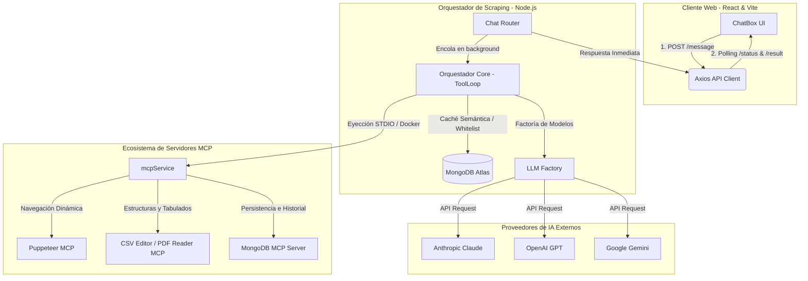
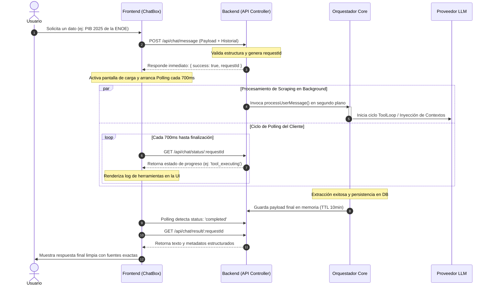
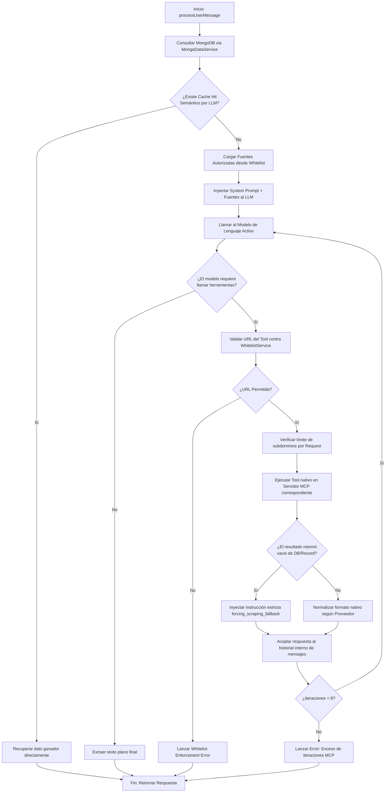

# MCP Dynamic WebScraper - Trusted Market Intelligence Platform

Este proyecto es un **Webscraper inteligente y autónomo** diseñado para la búsqueda, extracción y consolidación de datos e indicadores económicos provenientes exclusivamente de **fuentes oficiales y de confianza** preestablecidas por el usuario (como INEGI, Banxico, CONEVAL, etc.). 

A través del **Model Context Protocol (MCP)**, los modelos de lenguaje se transforman en agentes de extracción capaces de ejecutar herramientas avanzadas de navegación, lectura de documentos estructurados y almacenamiento semántico en un entorno completamente auditado y restringido por listas de permisos (*Whitelist Enforcement*).

El proyecto soporta dos modalidades de despliegue:
1. **Modalidad Web Fullstack**: Interfaz web interactiva (React/Vite) con arquitectura asíncrona por *polling* para scraping de larga duración sin cortes por timeout de red.
2. **Modalidad Claude Desktop**: Integración directa del ecosistema completo de servidores MCP (locales y Dockerizados) dentro de la aplicación de escritorio oficial de Anthropic.

---

## 🏗️ Arquitectura General del Sistema (Modo Web)

El ecosistema web divide el flujo de raspado entre un cliente reactivo, un orquestador asíncrono en Express y un clúster de microservicios MCP aislados.



---

## ⚙️ Flujo Asíncrono de Scraping (Evita HTTP Timeout)

Dado que el web scraping profundo y el procesamiento de PDFs de gobierno pueden demorar más allá de los límites de un request HTTP tradicional, la plataforma utiliza un mecanismo desacoplado mediante identificadores únicos (`requestId`):



---

## 🔧 Flujo Interno de Ejecución del Agente (`ToolLoop`)

El orquestador backend corre un flujo iterativo cerrado de máximo 8 interacciones donde el modelo decide qué herramientas MCP utilizar de forma secuencial y determinista:



---

## 🛠️ Instalación y Despliegue de la Versión Web

### 1. Variables de Entorno (`.env`)
Configura tu archivo `.env` en la raíz de la carpeta `backend/`. Parametriza tus API Keys y tus **rutas absolutas locales** para mapear los directorios del Filesystem y volúmenes de Docker:

```env
PORT=3000
NODE_ENV=development
MONGODB_URI=mongodb+srv://<USER>:<PASSWORD>@mcp-cluster.xxxx.mongodb.net/?retryWrites=true&w=majority
MONGODB_DB_NAME=MCP-Server
ANTHROPIC_API_KEY=tu_key_anthropic_claude
OPENAI_API_KEY=tu_key_openai_gpt
GOOGLE_API_KEY=tu_key_google_gemini
MISTRAL_API_KEY=tu_key_mistral_ocr

# Control de Whitelist
WHITELIST_ENFORCEMENT_ENABLED=true
MAX_SUBDOMAINS_PER_REQUEST=3

# Mapeo Parametrizado de Directorios Locales (Portabilidad)
MCP_FS_BACKEND_PATH=C:/Ruta/A/Tu/Proyecto/backend
MCP_FS_WORK_PATH=C:/Ruta/A/Tu/Directorio/Work
MCP_FS_PROJECTS_PATH=C:/Ruta/A/Tu/Directorio/Projects
MCP_OCR_VOLUME_PATH=C:/Ruta/A/Tu/Directorio/OCR_Files
```

### 2. Preparación de Infraestructura Docker
Antes de lanzar el servidor, debes pre-construir de forma local las imágenes personalizadas descritas en tu configuración:

```bash
# A) Construir microservicio local de Visión
cd VisionMCP
docker build -t pdf-vision-mcp:latest .

# B) Construir utilidades de scraping y OCR estructurado
docker build -t csv-editor-mcp .
docker build -t mcp-mistral-ocr:latest .

# C) Descargar imágenes oficiales de la comunidad
docker pull mcp/puppeteer:latest
docker pull mongodb/mongodb-mcp-server:1.6.0-2026-02-21
```

### 3. Ejecución en modo Local (Web Stack)
```bash
# Servidor Backend (API Orquestadora)
cd ../backend
npm install
npm start

# Cliente Frontend (Interfaz React)
cd ../frontend
npm install
npm run dev
```

---

## 🖥️ Integración con Claude Desktop (Modo Agente Autónomo)

Para omitir la interfaz web y delegar el control de raspado directamente a la aplicación oficial de **Claude Desktop**, puedes inyectar todo el ecosistema de herramientas MCP configurando un archivo de orquestación central.

### 1. Ubicación del archivo de configuración
Abre la aplicación Claude Desktop, ve a **Settings**, luego a la pestaña **Developer** y haz clic en **Edit Config**. Esto abrirá de forma automática el explorador de archivos de tu sistema operativo con el archivo `claude_desktop_config.json` seleccionado.

* Rutas por defecto del sistema:
  * **Windows**: `%APPDATA%\Claude\claude_desktop_config.json`
  * **macOS**: `~/Library/Application Support/Claude/claude_desktop_config.json`

### 2. Configuración de Servidores MCP (`claude_desktop_config.json`)
Sustituye o añade los siguientes servidores dentro del objeto de tu archivo de configuración, asegurando parametrizar tus rutas absolutas y llaves correspondientes de forma limpia:

```json
{
  "mcpServers": {
    "pdf-vision": {
      "command": "docker",
      "args": [
        "run",
        "-i",
        "--rm",
        "pdf-vision-mcp:latest"
      ]
    },
    "puppeteer": {
      "command": "docker",
      "args": [
        "run",
        "-i",
        "--rm",
        "--init",
        "-e",
        "DOCKER_CONTAINER=true",
        "mcp/puppeteer"
      ]
    },
    "csv-editor": {
      "command": "docker",
      "args": [
        "run",
        "-i",
        "--rm",
        "csv-editor-mcp"
      ]
    },
    "pdf-reader-mcp": {
      "command": "npx",
      "args": [
        "-y",
        "@sylphlab/pdf-reader-mcp"
      ]
    },
    "filesystem": {
      "command": "npx",
      "args": [
        "-y",
        "@modelcontextprotocol/server-filesystem",
        "C:/Ruta/A/Tu/Directorio/Work",
        "C:/Ruta/A/Tu/Directorio/Projects"
      ]
    },
    "mistral-ocr": {
      "command": "docker",
      "args": [
        "run",
        "-i",
        "--rm",
        "-p",
        "8403:8000",
        "-e",
        "MISTRAL_API_KEY=TU_API_KEY_MISTRAL",
        "-e",
        "OCR_DIR=/data/ocr",
        "-v",
        "C:/Ruta/A/Tu/Directorio/OCR_Files:/data/ocr",
        "mcp-mistral-ocr:latest"
      ],
      "env": {
        "MISTRAL_API_KEY": "TU_API_KEY_MISTRAL",
        "OCR_DIR": "/data/ocr"
      }
    },
    "MongoDB": {
      "command": "docker",
      "args": [
        "run",
        "--rm",
        "-i",
        "-e",
        "MDB_MCP_READ_ONLY=false",
        "-e",
        "MDB_MCP_API_CLIENT_ID",
        "-e",
        "MDB_MCP_API_CLIENT_SECRET",
        "mongodb/mongodb-mcp-server:latest"
      ],
      "env": {
        "MDB_MCP_API_CLIENT_ID": "tu_mongodb_client_id",
        "MDB_MCP_API_CLIENT_SECRET": "tu_mongodb_client_secret"
      }
    }
  }
}
```

### 3. Inyección Automática de Contexto ("Instructions for Claude")
Para que Claude comprenda las restricciones de precisión de datos y ejecute de forma transparente el flujo secuencial determinado por tu base de datos en cada nuevo chat, debes inyectar la instrucción de arranque.

Ve a **Settings** -> **Instructions for Claude**, y añade la siguiente directiva:

> *"I am testing a webscraper that follows a specific workflow. The workflow can be found using the mongodb mcp tool following these connection: MCP-cluster -> MCP-server -> Context. This is the Connection String: mongodb+srv://<USER>:<PASSWORD>@mcp-cluster.xxxx.mongodb.net/"*

Al iniciar un hilo conversacional, Claude Desktop detectará automáticamente la presencia de las herramientas MCP (mostrando el icono del clip de herramientas abajo a la derecha), se conectará silenciosamente al clúster para leer las colecciones de contexto y listas de exclusión, operando de forma 100% autónoma y controlada sobre las fuentes confiables.

---

## 🏫 Créditos y Servicio Social

Este proyecto fue desarrollado bajo el marco institucional del **Tecnológico Nacional de México (TecNM) - Campus Culiacán** como parte del proceso para la liberación del **Servicio Social**.

* **Asesor del Proyecto:** Ricardo Rafael Quintero Meza
* **Tesista:** Rayo Caldera Retamoza
* **Encargado del Desarrollo y Arquitectura:** René Zaid Zazueta Rivas

<p>
  
  
</p>