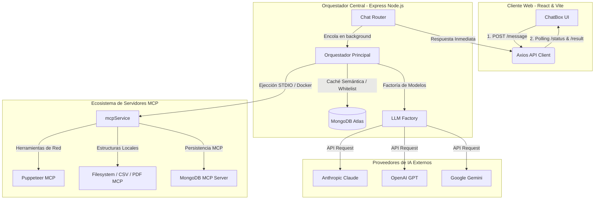
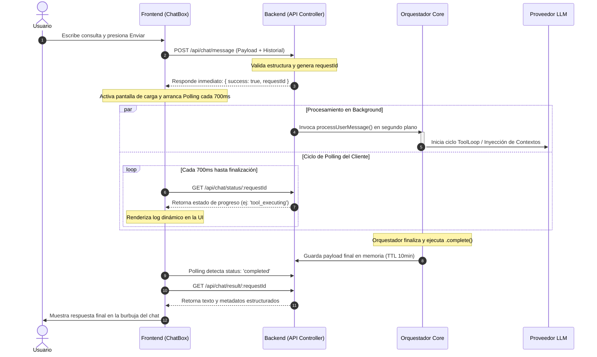
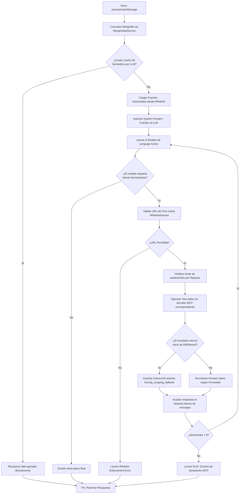

# MCP Web Deployment - AI Orchestrator & Fullstack Platform

Este proyecto es una plataforma fullstack modular diseñada para la integración, gestión y orquestación inteligente de Modelos de Lenguaje de Gran Escala (LLMs) como Claude, ChatGPT y Gemini, utilizando la especificación nativa de **Model Context Protocol (MCP)**. 

La plataforma cuenta con un backend desacoplado que ejecuta flujos multi-herramienta automatizados (`ToolLoop`) y un frontend reactivo en tiempo real con streaming de estados de procesamiento.

---

## 🏗️ Arquitectura General del Sistema

El ecosistema se divide en un cliente de interfaz SPA, un servidor orquestador de API y un clúster de microservicios MCP ejecutados nativamente o a través de contenedores aislados.



---

## 📂 Estructura del Repositorio

```text
├── backend/                       # Servidor Node.js (Express & Orchestrator)
│   ├── config/                    # Entornos y mcpConfig.js (Mapeo de servidores)
│   ├── controllers/               # Controladores de la API (chatController.js async)
│   ├── middlewares/               # Validaciones de esquemas y errorHandler.js
│   ├── routes/                    # Definición de endpoints expuestos
│   └── services/                  # Capa lógica de infraestructura
│       ├── orchestrator/          # Lógica central del ToolLoop y ContextBuilder
│       ├── claudeService.js       # Integración SDK Anthropic
│       ├── geminiService.js       # Integración Google Generative AI (Identity-Shot)
│       ├── openaiService.js       # Integración OpenAI Core (Strict Schemas)
│       └── mcpService.js          # Core de conexión, filtrado y normalización MCP
│
└── frontend/                      # Cliente SPA (React + TypeScript + Vite)
    ├── src/
    │   ├── components/            # UI Components (ChatBox, MessageInput, MessageList)
    │   ├── services/              # Cliente HTTP (api.ts - Mecanismo de Polling)
    │   └── types/                 # Tipados estáticos TypeScript de la app
    └── vite.config.ts             # Configuración de compilación de Vite
```

---

## ⚙️ Arquitectura Asíncrona (Mecanismo de Polling)

Para evitar caídas por *Timeout* de red HTTP durante ejecuciones largas de web scraping o procesamiento masivo de datos, la plataforma utiliza un flujo completamente desacoplado mediante identificadores únicos (`requestId`):



---

## 🔧 Flujo Interno de Ejecución (`ToolLoop`)

Cuando una consulta requiere extraer información externa o consultar bases de datos, el orquestador backend corre un flujo iterativo cerrado con protección de subdominios y listas negras:



---

## 🛠️ Requisitos e Instalación Quickstart

### 1. Clonar y variables de entorno
```bash
git clone [https://github.com/Zastha/MCP-Web-Deployment.git](https://github.com/Zastha/MCP-Web-Deployment.git)
cd MCP-Web-Deployment
```

Configura un archivo `.env` en la carpeta `backend/` con tus credenciales:
```env
PORT=3000
NODE_ENV=development
MONGODB_URI=tu_conexion_mongodb
MONGODB_DB_NAME=MCP-Server
ANTHROPIC_API_KEY=tu_key_claude
OPENAI_API_KEY=tu_key_gpt
GOOGLE_API_KEY=tu_key_gemini
WHITELIST_ENFORCEMENT_ENABLED=true
MAX_SUBDOMAINS_PER_REQUEST=3
```

### 2. Levantar el Backend
```bash
cd backend
npm install
npm start
```

### 3. Levantar el Frontend (Vite)
En otra terminal independiente:
```bash
cd frontend
npm install
npm run dev
```

---

## 🧠 Características Especiales Implementadas

* **Identity-Shot Ingestion (Gemini)**: Implementa una inyección artificial dual de inicio de chat (`user`/`model`) para mitigar la autodegradación de prompts del sistema en Gemini 2.5, forzando la consistencia del rol de analista.
* **Filtro Selectivo de Herramientas (Web Mode)**: Restringe el catálogo global de herramientas a un subset de 16 herramientas esenciales de procesamiento de texto y scraping para OpenAI y Gemini, protegiendo las cuotas críticas de tokens por minuto (TPM).
* **Mitigación Estricta de Errores de Red**: Mapeo estricto e intercepción transparente en el flujo de ejecución de herramientas para solventar desajustes de nomenclatura por guiones bajos (`_`) introducidos por las limitantes nativas del SDK de Google.